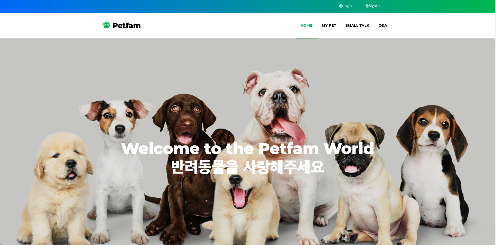
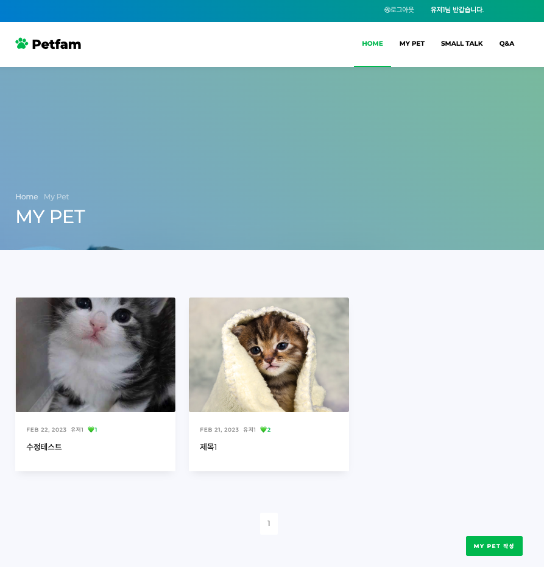
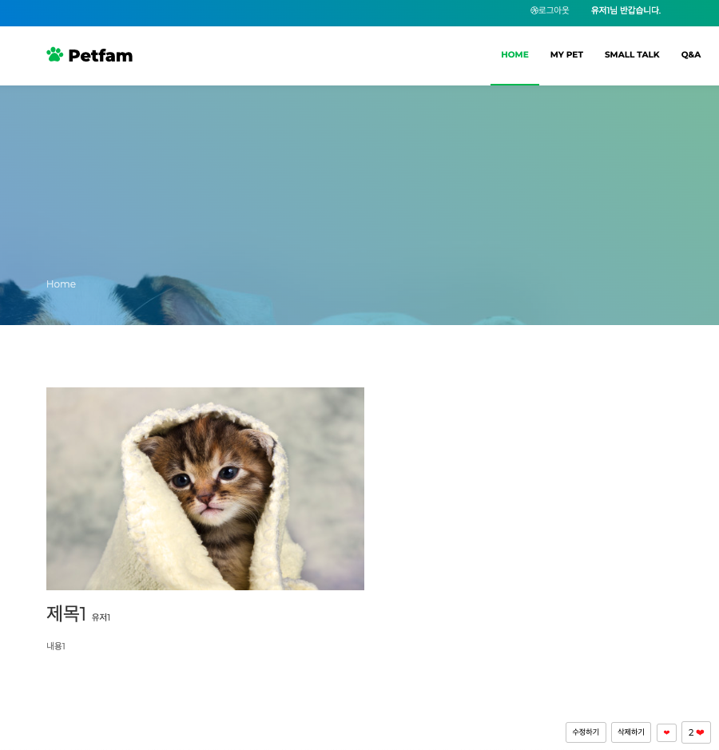
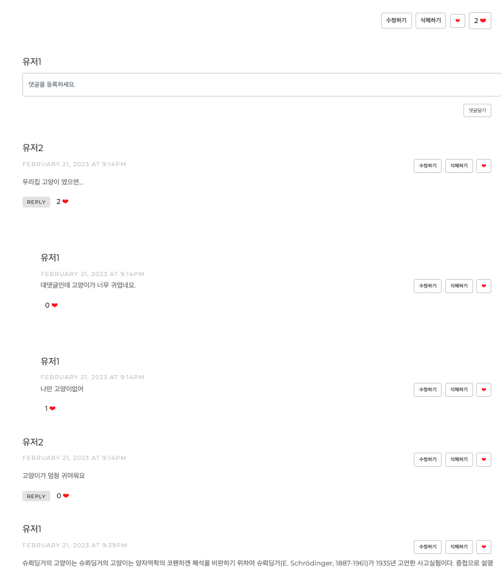
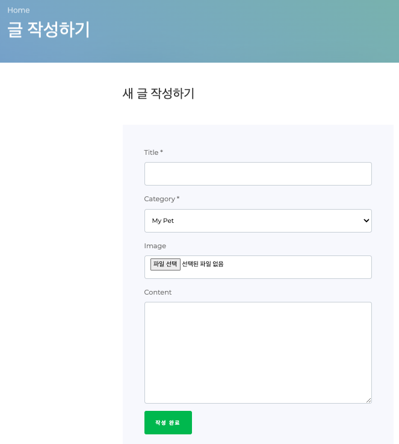
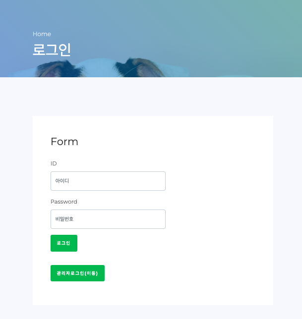
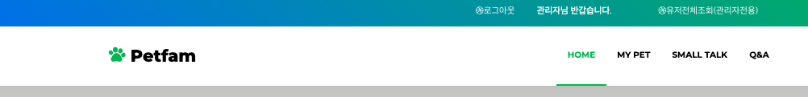
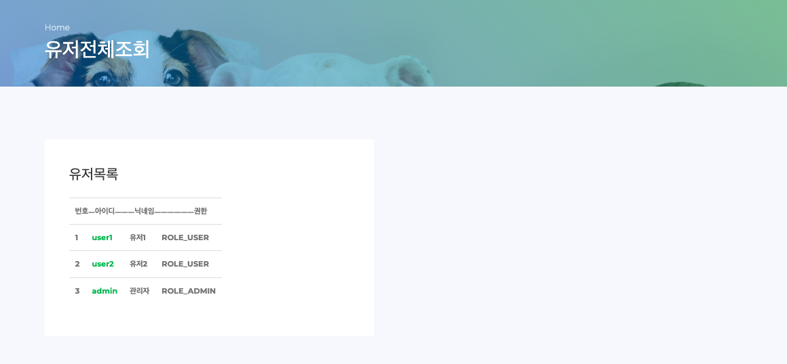
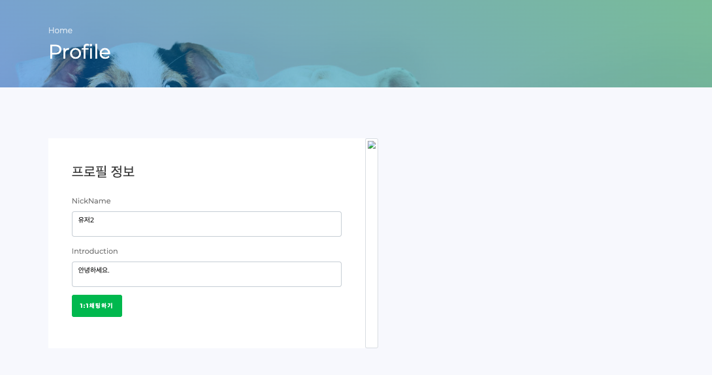

### [프론트 깃허브 주소](https://github.com/Dripmaster44/petfam_repo.git)

***

## 프로젝트 프리뷰

 프로젝트 프리뷰 

<figure>
  
  <figcaption style="text-align: center">메인 페이지</figcaption>
</figure>
<figure>
  
  <figcaption style="text-align:center">전체 게시글 리스트(카테고리별)</figcaption>
</figure>
<figure>
  
  <figcaption style="text-align: center">상세 게시글(본문)</figcaption>
</figure>
<figure>
  
  <figcaption style="text-align: center">상세 게시글(댓글)</figcaption>
</figure>
<figure>
  
  <figcaption style="text-align: center">글 작성 페이지</figcaption>
</figure>
<figure>
  
  <figcaption style="text-align: center">로그인</figcaption>
</figure>
<figure>
  
  <figcaption style="text-align: center">회원가입</figcaption>
</figure>
<figure>
  
  <figcaption style="text-align: center">메인 헤더(관리자용)</figcaption>
</figure>
<figure>
  
  <figcaption style="text-align: center">전체유저 조회(관리자용)</figcaption>
</figure>
<figure>
  
  <figcaption style="text-align: center">유저 프로필 정보</figcaption>
</figure>

## 프로젝트 환경

### *Back-end*

### *Front-end*

### *Tools*

***

## 1. 팀 소개

* 리더 :
  김갑신
* 부리더 :
  조은총
* 팀원 :
  안해리 ,
  진용재

## 2. 프로젝트 ERD

## 3. 서비스 아키텍쳐

## 4. 시연 영상

[유튜브 시연영상 링크](https://youtu.be/mbqhGZlpI0U)

## 5. MVP 목표

### 로그인/ 회원가입

- [x] JWT, Refresh 토큰 활용
- [x] 관리자, 유저 나누기
- [ ] 소셜 로그인 구현(카카오, 네이버, 구글)

### 메인 페이지

- [x] 최상단 이달/이주의 베스트 좋아요 반려동물 나오게하기
- [x] 최신순/인기순으로 나오게 하기
- [ ] 아래에 페이징된 반려동물 사진+이름+좋아요 갯수 나오게 하기 -> 클릭 시 상세 페이지로 이동

### 보조 페이지

- [x] 반려동물 관련 질문 페이지
- [x] 잡담 페이지
- [ ] 게시글의 조회수 불러오기(구현중)

### 1:1 채팅

- [x] DB 활용해서 구현
- [ ] 웹소켓 활용해서 구현

### 게시글 검색

- [ ] 해시태그기능(키워드) #냥스타그램🐱

